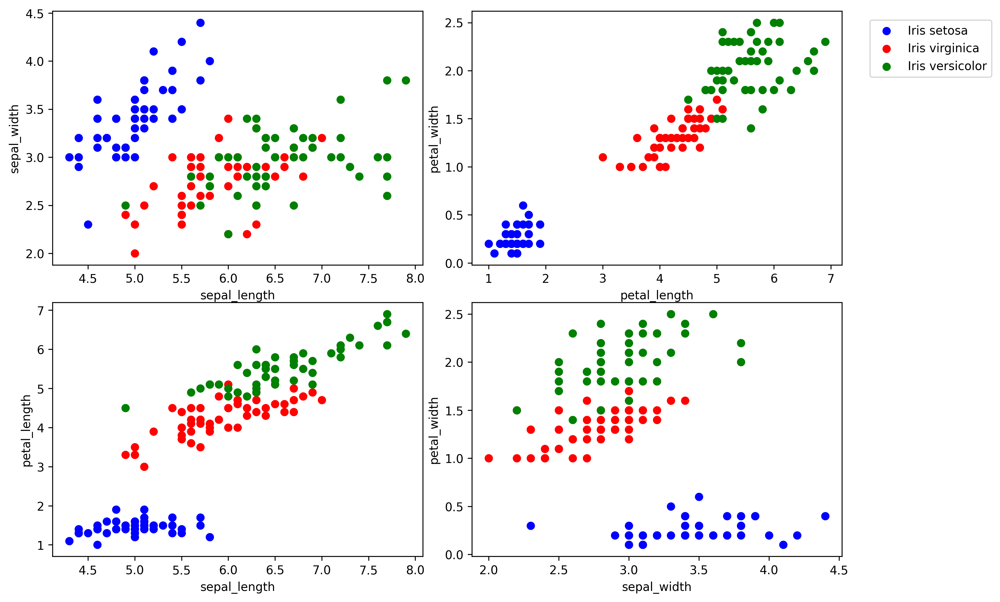
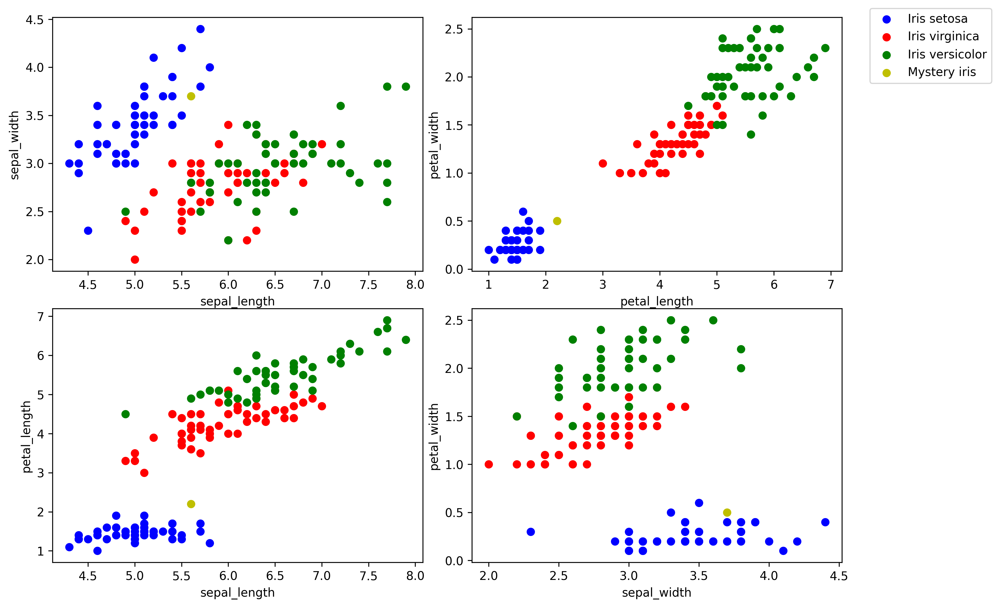

# Developing a Neural Network Classification Model

## AIM
To develop a neural network classification model for the given dataset.

## THEORY
The Iris dataset consists of 150 samples from three species of iris flowers (Iris setosa, Iris versicolor, and Iris virginica). Each sample has four features: sepal length, sepal width, petal length, and petal width. The goal is to build a neural network model that can classify a given iris flower into one of these three species based on the provided features.

## Neural Network Model
Include the neural network model diagram.

## DESIGN STEPS

### STEP 1: Data Preprocessing
- Load and clean the dataset.
- Normalize/scale the features if necessary.
- Split the dataset into training and testing sets.

### STEP 2: Model Architecture
- Define the structure of the neural network.
- Choose appropriate layers (e.g., input, hidden, and output layers).
- Specify activation functions for the layers.

### STEP 3: Compilation
- Initialize the model along with the criterion for loss calculation.
- Choose an optimizer and set the learning rate.
- Configure the model for training.

### STEP 4: Training the Model
- Pass the training data through the model.
- Compute the loss and perform backpropagation.
- Update the model parameters iteratively over several epochs.

### STEP 5: Evaluation
- Test the trained model on the test dataset.
- Compute evaluation metrics such as accuracy, confusion matrix, and classification report.
- Analyze the model performance.

### STEP 6: Prediction and Results
- Use the effective model for making new sample predictions.
- Interpret the results and document the output.
- Save the model for future inference.


## PROGRAM

**Name:** Keerthana S

**Register Number:** 212223240070

```py
class Model(nn.Module):
    def __init__(self, in_features=4, h1=8, h2=9, out_features=3):
        super().__init__()
        self.fc1 = nn.Linear(in_features,h1)
        self.fc2 = nn.Linear(h1, h2)
        self.out = nn.Linear(h2, out_features)

    def forward(self, x):
        x = F.relu(self.fc1(x))
        x = F.relu(self.fc2(x))
        x = self.out(x)
        return x

# Download the Iris dataset from UCI repository
url = "https://archive.ics.uci.edu/ml/machine-learning-databases/iris/iris.data"
df = pd.read_csv(url, header=None, names=["sepal_length", "sepal_width", "petal_length", "petal_width", "species"])

# Map species to target values
species_to_target = {"Iris-setosa": 0, "Iris-versicolor": 1, "Iris-virginica": 2}
df["target"] = df["species"].map(species_to_target)

# Display the first few rows
df.head()


epochs = 100
losses = []

for i in range(epochs):
    i+=1
    y_pred = model.forward(X_train)
    loss = criterion(y_pred, y_train)
    losses.append(loss)

    if i%10 == 1:
        print(f'epoch: {i:2}  loss: {loss.item():10.8f}')

    optimizer.zero_grad()
    loss.backward()
    optimizer.step()


```

### Dataset Information



### OUTPUT




## RESULT
A neural network classification model was successfully developed for the Iris dataset, achieving satisfactory performance in classifying iris species based on their features.
